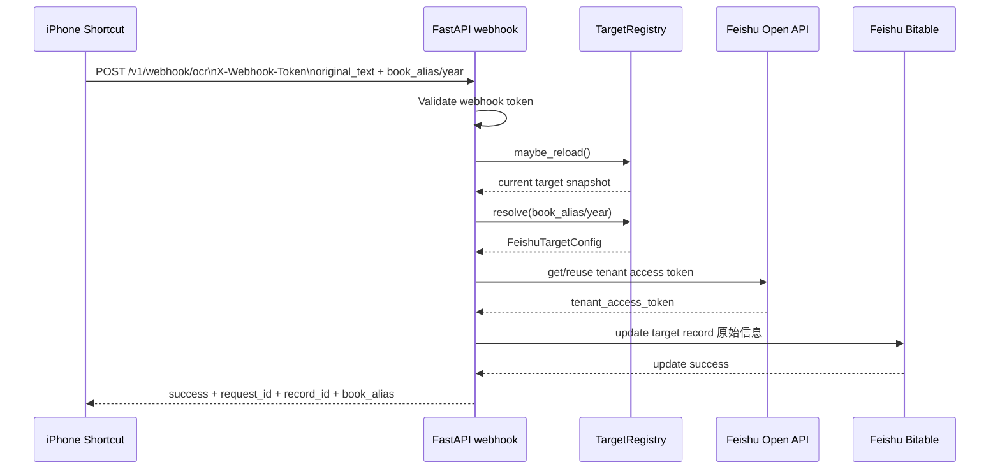

# 架构说明 / Architecture

## 语言切换 / Language

- 中文（默认）: [本页](architecture.md)
- English: [Architecture](en/architecture.md)

This service is a narrow FastAPI webhook bridge between iPhone Shortcuts OCR and Feishu Bitable.

当前稳定链路：

1. Shortcut performs OCR on a screenshot
2. User may review or correct the OCR result in Shortcut
3. Shortcut sends `POST /v1/webhook/ocr`
4. Service validates `X-Webhook-Token`
5. Service resolves the target book by `book_alias` or `year`
6. Service fetches or reuses a Feishu tenant access token
7. Service updates the selected fixed record field `原始信息`
8. Existing Feishu automation continues to generate follow-up fields

## 职责边界

本服务刻意只做三件事：

- 鉴权 webhook 请求
- 解析一个服务端预配置的飞书目标
- 把 `原始信息` 写入该目标记录

本服务**不会**解析账单字段、不会每次请求都创建新记录，也不会允许客户端提供飞书敏感凭据。

## 运行时配置模型

当前配置模型分为两层：

### 1. 静态服务配置

由 `app/config.py` 按如下顺序加载：

1. 进程环境变量
2. `FEISHU_ENV_FILE` 指向的外部 env 文件
3. 项目根目录 `.env`

包含这些值：

- `WEBHOOK_SHARED_TOKEN`
- `FEISHU_APP_ID`
- `FEISHU_APP_SECRET`
- `FEISHU_BASE_URL`
- 动态模式下的 `FEISHU_TARGETS_FILE`
- `FEISHU_TARGET_RELOAD_INTERVAL_SECONDS`
- `CONFIG_RELOAD_TOKEN`
- `HOST`
- `PORT`
- `LOG_LEVEL`
- `HTTP_TIMEOUT_SECONDS`
- `TOKEN_REFRESH_SKEW_SECONDS`

### 2. 动态目标注册表

由 `app/target_registry.py` 从 `FEISHU_TARGETS_FILE` 指向的 TOML 文件中加载。

每个目标只包含与路由目标相关的值：

- `app_token`
- `table_id`
- `record_id`
- `original_field_name`
- `enabled`
- 可选 `year`

公开请求中只允许携带安全选择器，例如 `book_alias` 或 `year`。

### 旧版兼容模式

如果没有配置 `FEISHU_TARGETS_FILE`，服务会退回到单一固定 env 目标模式。

旧版固定目标配置：

- `FEISHU_APP_TOKEN`
- `FEISHU_TABLE_ID`
- `FEISHU_RECORD_ID`
- `FEISHU_ORIGINAL_FIELD_NAME`

## 请求契约

`POST /v1/webhook/ocr` 请求体：

```json
{
  "original_text": "OCR extracted text from the screenshot",
  "source": "ios-shortcuts",
  "raw_ocr": "raw ocr text",
  "book_alias": "2026"
}
```

支持的选择器字段：

- `book_alias`
- `year`

规则：

- 如果两个选择器都未提供，则使用 `default_alias`
- 如果两个选择器同时存在但冲突，则拒绝请求
- `app_token`、`table_id`、`record_id`、`app_secret` 等额外字段一律禁止

## Token 与客户端行为

`app/feishu_client.py` 将飞书 tenant token 缓存在服务层。

原因：

- 第一版实现中，`FEISHU_APP_ID` 与 `FEISHU_APP_SECRET` 仍保持全局
- 年度切换通常改变的是记录/表/应用 token 目标，而不是应用凭据本身

每次请求先解析一个目标，再基于该目标构建飞书更新 URL。

## 动态重载模型

服务支持两种目标模式：

- **legacy 模式**：没有 `FEISHU_TARGETS_FILE`，直接使用 env 中的固定目标
- **dynamic 模式**：从外部 TOML 注册表加载多个目标

动态模式重载路径：

- 请求路径会通过文件 mtime 和最小间隔调用 `maybe_reload()`
- 可选的 `POST /admin/config/reload` 可以强制立即刷新
- 如果变更后的注册表非法，服务会采用 fail-closed 策略，阻止写入直到修复

### 注册表约束

当前解析器会强制要求：

- `default_alias` 必须存在
- 默认目标必须启用
- alias 名称必须满足安全格式
- 每个目标的必填字段不能为空
- 如果声明了 year，则 year 不能重复

## 时序图



## 安全边界

关键边界：

- Shortcut 只持有 webhook token 和业务载荷
- 服务端持有飞书敏感凭据和目标注册表
- 镜像中只包含代码与依赖

这样既能保持开源部署模型不退化，又能支持动态账本选择。
