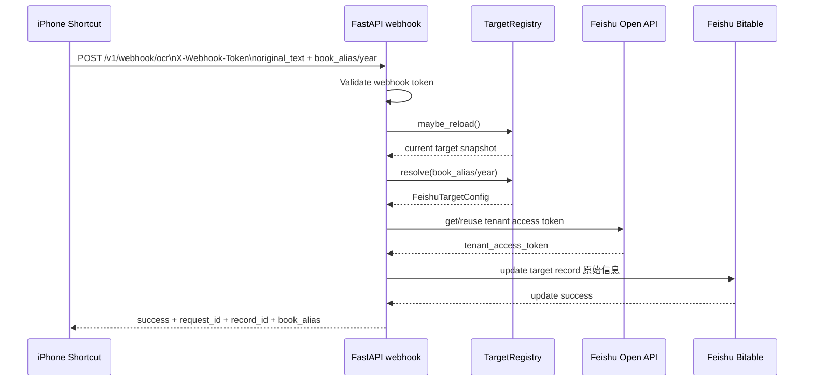

# Architecture

## Language

- English: [Architecture](architecture.md)
- Chinese: [架构说明](../architecture.md)

This service is a narrow FastAPI webhook bridge between iPhone Shortcuts OCR and Feishu Bitable.

## Current stable flow

1. Shortcut performs OCR on a screenshot
2. User may review or correct the OCR result in Shortcut
3. Shortcut sends `POST /v1/webhook/ocr`
4. Service validates `X-Webhook-Token`
5. Service resolves the target book by `book_alias` or `year`
6. Service fetches or reuses a Feishu tenant access token
7. Service updates the selected fixed record field `原始信息`
8. Existing Feishu automation continues to generate follow-up fields

## Responsibilities

The service intentionally does only three things:

- authenticate the webhook request
- resolve one server-side configured Feishu target
- write `原始信息` to that target record

The service does **not** parse accounting fields, create new records per request, or let clients provide Feishu secrets.

## Runtime configuration model

The configuration model has two layers:

### 1. Static service config

Loaded by `app/config.py` in this order:

1. process environment variables
2. external env file pointed to by `FEISHU_ENV_FILE`
3. project-root `.env`

These values include:

- `WEBHOOK_SHARED_TOKEN`
- `FEISHU_APP_ID`
- `FEISHU_APP_SECRET`
- `FEISHU_BASE_URL`
- `FEISHU_TARGETS_FILE` in dynamic mode
- `FEISHU_TARGET_RELOAD_INTERVAL_SECONDS`
- `CONFIG_RELOAD_TOKEN`
- `HOST`
- `PORT`
- `LOG_LEVEL`
- `HTTP_TIMEOUT_SECONDS`
- `TOKEN_REFRESH_SKEW_SECONDS`

### 2. Dynamic target registry

Loaded by `app/target_registry.py` from a TOML file pointed to by `FEISHU_TARGETS_FILE`.

Each target contains only target-specific routing values:

- `app_token`
- `table_id`
- `record_id`
- `original_field_name`
- `enabled`
- optional `year`

The public request carries only a safe selector like `book_alias` or `year`.

### Legacy compatibility mode

If `FEISHU_TARGETS_FILE` is not configured, the service falls back to one fixed target from env.

Legacy fixed-target values:

- `FEISHU_APP_TOKEN`
- `FEISHU_TABLE_ID`
- `FEISHU_RECORD_ID`
- `FEISHU_ORIGINAL_FIELD_NAME`

## Request contract

`POST /v1/webhook/ocr` body:

```json
{
  "original_text": "OCR extracted text from the screenshot",
  "source": "ios-shortcuts",
  "raw_ocr": "raw ocr text",
  "book_alias": "2026"
}
```

Supported selector fields:

- `book_alias`
- `year`

Rules:

- if neither selector is present, use `default_alias`
- if both are present and conflict, reject the request
- extra fields such as `app_token`, `table_id`, `record_id`, or `app_secret` are forbidden

## Token and client behavior

`app/feishu_client.py` keeps the Feishu tenant token cache at the service level.

Why:

- `FEISHU_APP_ID` and `FEISHU_APP_SECRET` remain global in the first implementation
- yearly switching typically changes record/table/app-token targets, not the app credentials themselves

Each request resolves one target and then builds the Feishu update URL from that target.

## Dynamic reload model

The service supports two target modes:

- **legacy mode**: no `FEISHU_TARGETS_FILE`, use one fixed target from env
- **dynamic mode**: load multiple targets from the external TOML registry

Dynamic mode reload path:

- request path calls `maybe_reload()` using file mtime and a minimum interval
- optional `POST /admin/config/reload` can force immediate refresh
- if a changed registry becomes invalid, the service fails closed and blocks writes until fixed

### Registry constraints

The current parser enforces:

- `default_alias` must exist
- the default target must be enabled
- alias names must match a safe pattern
- required fields per target must be non-empty
- years must be unique if present

## Sequence diagram



## Security boundary

Important boundary:

- Shortcut owns only the webhook token and the business payload
- Server owns Feishu secrets and target registry
- The image contains code and dependencies only

This keeps the open-source deployment model intact while still allowing dynamic book selection.
